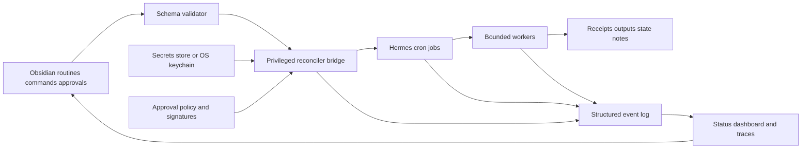
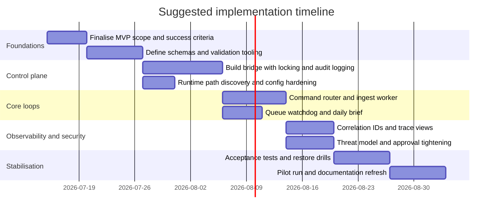

# OpenAI 5.5 Deep Research: Critical Review of the Hermes Obsidian Specification

## Executive summary

The uploaded material is not actually unspecified in practice: it is a detailed technical architecture and operating specification for a local-first automation system in which Obsidian acts as the desired-state interface, approvals surface and audit log; a privileged non-LLM bridge reconciles routine notes into native Hermes cron jobs; and Hermes cron executes bounded workers against a Markdown vault. The document is ambitious, unusually thorough, and materially grounded in Hermes platform behaviour such as fresh-session cron runs, disabled cron recursion within cron jobs, workdir-based serialisation, script-gated jobs, and timezone/model pinning considerations. That gives it a strong conceptual base. fileciteturn0file0 citeturn3view0turn3view1turn3view2turn3view3turn3view4turn3view5

My overall judgement is that the specification is **architecturally strong but operationally over-scoped for a first implementation**. It already contains the right instincts: desired-state reconciliation, explicit schemas, leases, approvals, immutable raw evidence, bounded workers, receipts, recovery tests, and a trust boundary around imported content. Those choices align well with established control-loop and GitOps-style patterns in Kubernetes, Flux and Argo CD, where a declarative desired state is continuously reconciled with real-world state and drift is made visible rather than ignored. fileciteturn0file0 citeturn18view0turn18view3turn18view4turn18view5

The main weaknesses are not in the core idea but in **implementation risk**. The spec currently assumes that Markdown can act as both human interface and durable operational database for commands, leases, approvals, retries and receipts. That is possible at small scale, but it increases the risk of race conditions, sync conflicts, schema drift, brittle frontmatter parsing, and hard-to-debug recovery paths. The most important under-specified component is the privileged bridge: it is the system’s real control plane, yet it has less concrete treatment than the workers it governs. Observability is also thin: the document defines status notes and logs, but not a clear trace/metric model for following a command end-to-end. fileciteturn0file0 citeturn18view6turn20view0

The best path forward is **not** to discard the design. It is to **reduce the MVP, harden the control plane, and formalise contracts**. In practice, that means: first, narrow the initial loop set to bridge + router + ingest + watchdog + daily brief; second, make schemas machine-validatable; third, add structured event IDs and traces; fourth, separate high-risk actions from general knowledge work even more sharply; and fifth, decide whether Markdown remains the only source of truth or whether operational state moves into SQLite/PostgreSQL while Obsidian remains the primary human interface. That recommendation is reinforced by official workflow/orchestration guidance from Temporal, which treats durable event history as the source of truth for long-running execution, and by AWS guidance on idempotent client request identifiers for retry-safe mutations. citeturn20view0turn8view1turn8view3

If this were being approved today, I would rate it as follows: **strategy 8.5/10, documentation 8/10, implementation readiness 5.5/10, and governance/security maturity 7/10**. It is good enough to proceed, but only if it is treated as a **programme specification** that now needs a shorter, testable implementation standard. fileciteturn0file0

| Executive judgement | Assessment |
|---|---|
| Strategic direction | Strong |
| Technical feasibility | Moderate |
| MVP scope discipline | Weak to moderate |
| Governance and control | Strong in principle |
| Operability and observability | Moderate |
| Accessibility and readability | Moderate |
| Recommended decision | Proceed, but with a reduced and hardened Phase One |

## Material profile and intended audience

The document’s core content is a full-stack operating model for a Hermes-powered knowledge and automation environment. It covers architecture, routine definitions, command schemas, state transitions, control commands, loop contracts, cron creation examples, retry policy, security requirements, backups, acceptance tests and a definition of what it means for the system to be “alive”. In effect, it is trying to be four things at once: an architecture decision record, an implementation specification, an operational runbook, and a governance policy. fileciteturn0file0

Its primary objectives are clear. It aims to create a human-readable and auditable automation system in which routine definitions and work commands are expressed as Markdown; imported evidence is preserved immutably; AI workers are tightly bounded; external effects require approval; and the system continuously closes an observe–orient–decide–act–learn loop. Those aims are consistent with official Hermes behaviour around fresh cron sessions, script-backed jobs, workdir scoping, local vault tooling and LLM-wiki-style raw-source preservation. fileciteturn0file0 citeturn4view6turn3view4turn3view6turn3view7

The intended audience is primarily technical and cross-functional rather than purely developer-facing. The most obvious readers are a platform engineer implementing the bridge, an automation architect defining the operating model, a security reviewer checking trust boundaries, and an operations owner who will maintain the system once it is live. A secondary audience includes anyone writing routines, reviewing approvals, or using Obsidian dashboards to understand system state. That audience mix explains both the document’s strengths and its readability problems: it is rigorous enough for engineers, but dense for non-implementers. fileciteturn0file0

The document is also best understood as a **desired-state reconciler specification**, not just a cron design. That distinction matters. In operator-style systems, the central problem is not merely “run jobs on a schedule”; it is “continuously reconcile declared intent with actual state while making divergence visible and recoverable”. Kubernetes operators, Flux and Argo CD all frame the problem that way, and your document fits that lineage more closely than it fits a simple scheduled-task system. citeturn18view0turn18view3turn18view4turn18view5

## Critical assessment

### Where the specification is strongest

The strongest part of the material is its **alignment with real platform constraints**. The separation between Obsidian, the control bridge and Hermes cron is not arbitrary; it is a direct response to Hermes’s documented behaviour. Hermes cron runs in fresh agent sessions, the gateway scheduler ticks roughly once a minute, workdir jobs are serialised, and cron-run sessions cannot recursively manage cron jobs because the cron toolset is disabled inside scheduled runs. Designing a privileged external reconciler around those constraints is sound engineering, not overengineering. fileciteturn0file0 citeturn3view0turn3view1turn3view2turn4view6

The second major strength is the document’s **control discipline**. Explicit schemas, closed operation vocabularies, leases, revisions, approvals, idempotency receipts, immutable raw evidence, bounded batch processing, and mass-change approval thresholds are all good design decisions. They materially reduce three common failure modes in agent systems: uncontrolled scope expansion, ambiguous authority, and duplicate side effects. The idempotency and approval model is especially well judged. AWS’s guidance on idempotent APIs makes the same core point: retries are safest when each mutating request carries a unique caller-provided identifier and when later requests with the same ID can be detected, audited and rejected if the intent has changed. fileciteturn0file0 citeturn8view1turn8view3

The third strength is **security awareness**. The spec explicitly treats imported files, emails, webpages and transcripts as untrusted data, forbids instruction execution from raw material, constrains toolsets per job, and requires approval for high-risk effects. That matches current prompt-injection guidance from OWASP, which stresses that indirect prompt injection arises when models consume external files or webpages and recommends least privilege, external-content segregation, deterministic output validation and human approval for high-risk actions. fileciteturn0file0 citeturn19view0

The fourth strength is **operational seriousness**. Many AI workflow documents stop at architecture. This one goes further and defines bootstrap phases, acceptance tests, stale-lease recovery, backup verification, daily brief structures, and a minimum viable definition of “alive”. That is a meaningful advantage because it turns the specification from a concept deck into something closer to a buildable operating system. fileciteturn0file0

### Where the specification is weakest

The biggest weakness is **scope inflation**. The document reads like a mature operating model for version two or three, but it is positioned as if much of it should exist near day one. In practice, an MVP that includes command routing, inbox triage, ingest, wiki ripple, project reconcile, approved action execution, queue watchdog, daily brief, lint, backup verification, doctrine synthesis, armory scan, outcome review and monthly audit is too broad for a first safe release. A tight MVP should prioritise the smallest loop set that proves ingestion, routing, visibility and recovery, then layer derived features later. fileciteturn0file0

The next weakness is **control-plane under-specification**. Ironically, the bridge is the most important component in the architecture, yet its implementation contract is thinner than the worker contracts. The document says the bridge should validate, hash, reconcile and supervise the gateway, but it does not specify canonical serialisation rules robustly enough, signature/authorisation rules for approvals, upgrade strategy, recovery after partial writes, or how bridge authority itself is protected. In a desired-state system, the reconciler is the crown jewel. Flux and Argo CD work precisely because reconciliation logic is the first-class control plane, not an appendix. fileciteturn0file0 citeturn18view3turn18view4

A third weakness is **operational state in Markdown**. Markdown is excellent as a human interface and audit surface, but weaker as the only durable store for leases, heartbeats, retries, status transitions and concurrent claims. Your spec mitigates that with revisions, leases and sequential workdir execution, yet the risk remains. Workdir jobs are serialised on each tick specifically because concurrent workdir execution can corrupt process-global current working directory state; that protection helps, but it also means throughput is bounded and state mutations remain file-based rather than transactional. For the bridge and high-value commands, SQLite or PostgreSQL would give stronger guarantees while still rendering state back into Markdown for human use. fileciteturn0file0 citeturn3view1turn20view0

There is also a **documentation drift risk** in some low-level assumptions. The spec hardcodes cron storage paths such as `~/.hermes/cron/jobs.json`, but the current Hermes source code scopes cron storage under the active `HERMES_HOME` / profile, for example `~/.hermes/profiles/<profile>/cron/jobs.json`, and explicitly warns against collapsing profiles into a shared root. That means path handling should be treated as runtime-resolved state, not a fixed filesystem contract in the spec. fileciteturn0file0 citeturn22view0turn3view11

### Gaps, risks and opportunities

Several practical gaps stand out. The first is **observability**. The spec has status dashboards and logs, but it lacks a concrete telemetry model. There is no single command correlation ID format carried across routine reconciliation, worker claims, receipts, outputs and alerts. OpenTelemetry’s tracing model is relevant here because traces exist to show the full path of a request through an application; without something analogous, recovery and diagnosis will remain manual. fileciteturn0file0 citeturn18view6

The second gap is **timing realism**. Hermes’s gateway scheduler checks for due work about every 60 seconds, and `run` triggers execution on the next scheduler tick rather than instantly. The spec acknowledges this, but some service-level objectives and two-minute loops still read as if they are precise rather than coarse-grained. If you need stronger guarantees for the bridge, backups or host-level supervision on Linux, systemd timers provide native supervision features such as `Persistent=` for catching missed `OnCalendar=` runs, time-sync ordering, and explicit accuracy/jitter controls. fileciteturn0file0 citeturn3view2turn21view0turn21view1turn21view2turn21view3

The third gap is **human factors and accessibility**. The specification is readable for engineers, but it is not yet easy to scan. GOV.UK’s content design guidance recommends frontloading the most important information, using descriptive headings, breaking up text, avoiding repetition, and using plain language; WCAG 2.2 reinforces descriptive headings and labels, adequate contrast, reflow, and clear language metadata. Your document contains one architecture diagram and many good tables, but it would benefit from a shorter front section, clearer section summaries, more example notes, and a reduced amount of repeated policy wording. citeturn12view0turn12view1turn13view0turn13view1turn8view4turn8view5turn8view6turn8view7

The opportunity is substantial. The document is already close to a **reference architecture for controlled agent operations in a personal or team knowledge environment**. With tighter control-plane definition, stronger telemetry, smaller MVP scope and cleaner information design, it could become both an internal implementation guide and a publishable pattern for safe local-first agent orchestration. fileciteturn0file0

### Assessment scorecard

| Dimension | Rating | Assessment | Evidence |
|---|---:|---|---|
| Content and architecture | 5/5 | Strong separation of interface, reconciler and executor; good use of bounded agents and state machines | fileciteturn0file0 citeturn3view0turn3view1turn4view6 |
| Structure | 4/5 | Logically organised, but too long for first-time implementers | fileciteturn0file0 |
| Clarity | 3/5 | Precise, but dense and sometimes repetitive | fileciteturn0file0 citeturn12view0turn12view1 |
| Evidence | 4/5 | Good use of Hermes docs and source, but some assumptions should be runtime-resolved not hardcoded | fileciteturn0file0 citeturn22view0turn3view11 |
| Tone | 4/5 | Appropriate for engineering governance; slightly over-prescriptive in places | fileciteturn0file0 |
| Accessibility | 2/5 | Better than many specs, but still text-heavy and only partly optimised for skimming and assistive reading | citeturn12view0turn12view1turn8view4turn8view7 |
| Visual design | 2/5 | Helpful diagram and tables, but not enough navigational aids, examples or condensed views | fileciteturn0file0 |
| Security and governance | 4/5 | Strong trust-boundary thinking; still needs a more formal bridge threat model | fileciteturn0file0 citeturn19view0turn23view2turn23view3 |
| Operability | 3/5 | Good recovery/testing intent; thin telemetry and bridge hardening reduce confidence | fileciteturn0file0 citeturn18view6turn20view0 |

## Recommendations and alternatives

### Prioritised recommendations

The recommendations below assume a local/self-hosted deployment, one engineering owner, and a desire to stay aligned with official Hermes capabilities rather than replacing them.

| Priority | Recommendation | Horizon | Effort | Estimated cost | Expected impact |
|---|---|---|---|---:|---|
| Highest | Reduce MVP to **bridge + command router + ingest worker + watchdog + daily brief**; defer doctrine, armory, outcome review, project reconcile and action worker until core lifecycle tests pass | Short-term | 5–8 days | AUD 4,000–10,000 | Very high |
| Highest | Make schemas executable: define JSON Schema or Pydantic models for `routine`, `command`, `control`, `receipt`, `status` and `raw-source` notes; reject invalid notes before reconciliation | Short-term | 4–6 days | AUD 3,000–8,000 | Very high |
| Highest | Treat the bridge as a first-class service: signed or role-based approval checks, atomic writes, explicit lock strategy, bridge-level audit log, upgrade/restart semantics | Short-term | 7–12 days | AUD 6,000–15,000 | Very high |
| High | Add end-to-end correlation IDs and structured telemetry for every routine run, claim, output, receipt and alert; expose a minimal trace view in Obsidian | Short-term | 4–7 days | AUD 3,000–9,000 | High |
| High | Replace hardcoded Hermes internal paths with runtime-discovered paths derived from active `HERMES_HOME` / profile context | Short-term | 1–2 days | AUD 500–2,000 | High |
| High | Add a formal **threat model** for prompt injection, path traversal, vault sync conflicts, approval spoofing, and bridge compromise | Medium-term | 3–5 days | AUD 2,000–6,000 | High |
| Medium | Decide whether Markdown remains the operational source of truth or whether leases/retries/claims move into SQLite while Markdown stays the human interface | Medium-term | 5–10 days | AUD 4,000–12,000 | High |
| Medium | Tighten content design: add a “Quick start”, a “Decision summary”, example files for each schema, and shorter implementation profiles | Medium-term | 2–4 days | AUD 1,000–4,000 | Medium |
| Medium | If deployed on Linux, supervise the bridge and gateway with systemd units/timers rather than relying only on Hermes cron for liveness-adjacent tasks | Medium-term | 2–3 days | AUD 500–3,000 | Medium |
| Longer-term | Consider moving high-risk long-running workflows to a durable workflow engine if action execution becomes central, multi-step, or externally stateful | Long-term | 10–20 days | AUD 10,000–30,000 | Medium to high |

The architectural heart of the improvement plan is shown below. The key change is not conceptual; it is that the bridge becomes explicit, typed and observable.

This revised flow stays faithful to the uploaded design, but it makes three hidden assumptions explicit: validation, telemetry and approval enforcement. That is closer to the operator/GitOps model used by Flux and Argo CD, where reconciliation, drift visibility and auditable state are first-class concerns. citeturn18view3turn18view4turn18view5

### Option comparison

| Option | What changes | Advantages | Disadvantages | Best fit |
|---|---|---|---|---|
| Harden the current Markdown-first design | Keep Markdown as source of truth; add schemas, traces and a stronger bridge | Lowest migration cost; best Obsidian experience; stays closest to Hermes docs and current spec | File-based state remains fragile under higher concurrency and sync conflicts | Single-user or small-team deployment |
| Split human state from machine state | Markdown remains interface; SQLite or PostgreSQL stores claims, retries, receipts and bridge state | Stronger transactional guarantees; easier reporting and recovery; clearer upgrade path | More moving parts; less “everything is Markdown” purity | Small-team system expected to grow |
| Move long-running/high-risk work to a workflow engine | Keep Obsidian for approval and intent; use Temporal or similar for durable execution | Strong durability, replay, retries and event history for complex actions | Highest complexity; larger conceptual shift | External-effect-heavy or multi-step automations |

The third option is worth considering only if the system evolves from “knowledge maintenance with bounded actions” into “durable multi-step operational workflows”. Temporal’s workflow model is relevant because it treats event history as the execution source of truth and rebuilds workflow state by replaying recorded events, which is exactly the kind of durability Markdown alone cannot provide for complex external actions. citeturn20view0

### Templates, frameworks and reference examples

| Reference | What it demonstrates | Practical lesson for this specification |
|---|---|---|
| Kubernetes Operator pattern | Controllers continuously drive reality toward configured resources | Treat routine notes as declarative resources and the bridge as a real reconciler, not just a file watcher. citeturn18view0 |
| Flux reconciliation | Desired state should be checked on intervals and drift should be corrected or surfaced | Add clearer drift states for routines and machine-readable reconcile outcomes. citeturn18view3 |
| Argo CD | Live state versus desired state visualisation and controlled sync | Improve dashboards so operators can see “OutOfSync”, “Degraded”, “Paused”, “Awaiting approval” at a glance. citeturn18view4turn18view5 |
| AWS idempotent APIs | Caller-provided request IDs and parameter-mismatch checks make retries safe | Preserve plan hashes, command IDs and step IDs as stable idempotency keys for every external effect. citeturn8view1turn8view3 |
| OWASP Prompt Injection guidance | External files and webpages are untrusted and require segregation, validation and least privilege | Expand the spec’s trust-boundary section into a formal threat model and red-team test pack. citeturn19view0 |
| GOV.UK content design | Frontload information, use clear headings, short summaries and plain language | Shorten the spec front matter, add descriptive headings, and create summary cards for each loop. citeturn12view0turn12view1turn13view0turn13view1 |
| WCAG 2.2 | Headings, contrast, reflow and language metadata matter for accessibility | Ensure published dashboards, docs and exported reports meet heading, contrast and reflow expectations. citeturn8view4turn8view5turn8view6turn8view7 |

## Delivery roadmap and implementation resources

A practical implementation should be phased. The timing below assumes one lead engineer with part-time reviewer support. If staffing is lighter, the sensible response is to cut scope further, not to compress testing.

### Phased timeline

### Required resources, skills and tools

| Area | Minimum resources required | Why it matters |
|---|---|---|
| Platform engineering | 1 engineer comfortable with Python, file locking, service supervision and schema validation | Needed for the bridge, scripts, state handling and deployment |
| Automation architecture | 1 designer/owner for command vocabulary, approval model and risk tiers | Prevents scope creep and inconsistent semantics |
| Security review | 1 reviewer for threat modelling and approval controls | Necessary because the bridge is privileged and imported content is untrusted |
| Content design | 1 part-time technical writer or reviewer | Improves usability, onboarding and maintenance of the spec |
| Runtime tools | Hermes gateway, pinned models, local vault, OS keychain, logging/telemetry sink, test harness | Required to operate and observe the system |
| Optional infrastructure | SQLite/PostgreSQL, systemd on Linux, OpenTelemetry collector, CI for schema tests | Strongly recommended for hardening beyond prototype phase |

The most important skill gap to anticipate is not AI prompting; it is **control-plane engineering**. The bridge needs the engineering rigour of a small operator/controller, not the style of an agent prompt. The second most important skill is **reliability engineering**: acceptance tests, restore drills, retry design, idempotency, and auditability. That is why the best external reference points for this design are Kubernetes controllers, AWS idempotency patterns and durable workflow systems rather than generic note-taking automation. citeturn18view0turn8view1turn20view0

## Action checklist

1. **Cut the MVP to five loops**: bridge, router, ingest, watchdog and daily brief.  
2. **Make every schema executable** with strict validation before any reconcile or claim.  
3. **Harden the bridge first**: locks, approvals, path discovery, audit log, restart semantics.  
4. **Add structured observability**: correlation IDs, receipt IDs, and end-to-end traceable events.  
5. **Decide deliberately on state storage**: stay Markdown-first for simplicity, or move machine state to SQLite for safety before scale increases.
